# このフローについて

このフローは、東京ビッグサイトで開催された「IoT/M2M展2018春」にてアナログ・デバイセズ社ブースで実際にデモンストレーションを行っていた内容です。会場の様子や展示の意図については、[EE Times Japan「まずはPoCレベルで」に応える：
20万円で始められる、ADIのIoTプラットフォーム 」](http://eetimes.jp/ee/articles/1805/10/news076.html)や[マイナビ「IoT開発に困った人を助けるプログラム - ADIが提供を開始」](https://news.mynavi.jp/article/japan_it_week_spring2018-9/)にて掲載されていますのでご一読ください。

フローの内容とともに、デモンストレーションに必要なサービスのセットアップ手順も追記しています。

# 用語集

- モート(mote) ... アナログ・デバイセズ社のSmartMesh®ネットワークを構成する端末を指します。このデバイスのアドレスを「MACアドレス」と呼んでいます。
- [conect+(コネクトプラス)](https://www.conect.plus)  ... SBイノベンチャー社のスマホUI作成サービスです。

# フローの一覧

1. [`candy-egg-001.json`](./candy-egg-001.json) ... `CANDY EGG to conect+`フロー。CANDY EGGからconect+のクラウドへデータを転送するフローです。
1. [`candy-egg-002.json`](./candy-egg-002.json) ... `conect+ to CANDY EGG`フロー。conect+のクラウドからのAPIコールを受け付けて処理をするフローです。
1. [`candy-egg-003.json`](./candy-egg-003.json) ... `SmartMesh Notifications`フロー。SmartMesh®のメッシュネットワーク状態イベントを表示するフローです。
1. [`candy-red.json`](./candy-red.json) ... `SmartMesh Example`フロー。デバイス側のフローです。

# 使い方

## CANDY EGGクラウド側

### 必要なサービス

- [conect+](https://www.conect.plus) ... iPhone アプリ側へデータをやり取りするためのサービスです。このフローを動かす場合は、[フリープラン](https://www.conect.plus/pricing/)での利用も可能です。

### 必要な機器
- ノートパソコンなどデスクトップブラウザーを利用できる環境
- iPhone/iPad(conect+のアプリ用)

### CANDY EGG to conect+フロー

- フローファイル：[`candy-egg-001.json`](./candy-egg-001.json)

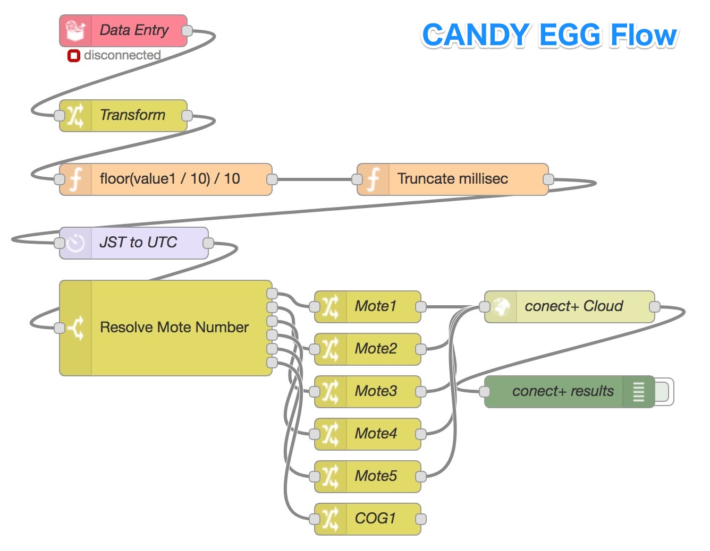

このフローでは、`CANDY RED`からWebsocketのAPI`/data`を経由して入ってきたデータを、conect+へ送信します。その時に、モートのMACアドレスごとに固有のプロパティ名を割り当てています。これは、conect+のクラウドにプロパティ名ごとに1つの温度センサーとして認識してもらうためです。

#### このフローのポイント

このフローでは、モートのMACアドレスとconect+の温度センサー情報とを関連づけています。この処理そのものは、デバイス側、つまり`CANDY RED`でも実施することは可能です。しかし、このようにクラウド側でアドレスの関連付けを行うことによって、デバイス側のフローを変更せずに済むため、モートの交換や削除といった対応がより簡単に行うことが可能になります。

#### 使用上の注意

インポートしただけではこのフローは機能しません。`Resolve Mote Number`のノードにMACアドレスの分岐がありますので、この分岐の中にあるMACアドレスをお使いのモートのMACアドレスに変更してください。また、conect+への設定も必要ですので、次のセクションもご覧ください。

### conect+の設定方法

CANDY EGGの「CANDY EGG to conect+フロー」をインポートした後に、conect+側の設定を行います。これによって、conect+のiPhoneのアプリでセンサーデータを見たり、LEDのON/OFFを指示したりすることができるようになります。

ここでは、conect+の画面を見ながらどのように設定するかを説明していきます。

まずはconect+にログインして、新しいプロジェクトを追加します。この時フリープランの場合は追加できないので、有償プランに変更するか、古いプロジェクトを変更するようにします。

まずは、プロジェクトの基本情報を設定します。
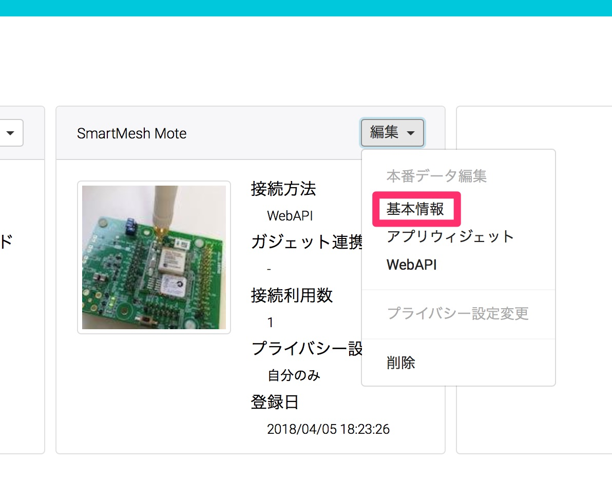

「編集」から「基本情報」を選ぶと次のような画面が現れます。
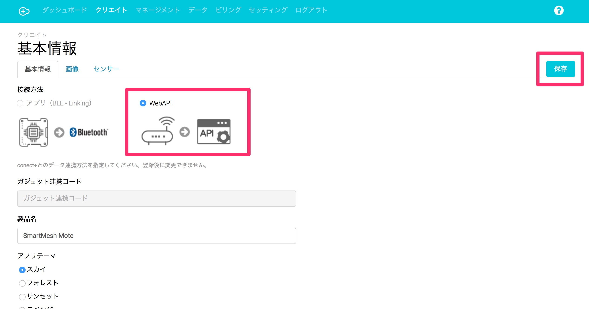

ここで、接続方法として「Web API」を選択します。
そのほか、アプリテーマはお好みで選択してください。
最後に右上の「保存」を押します。変更を反映するため、必ず保存をするようにしてください。

続いて、隣のタブ「画像」を選択します。
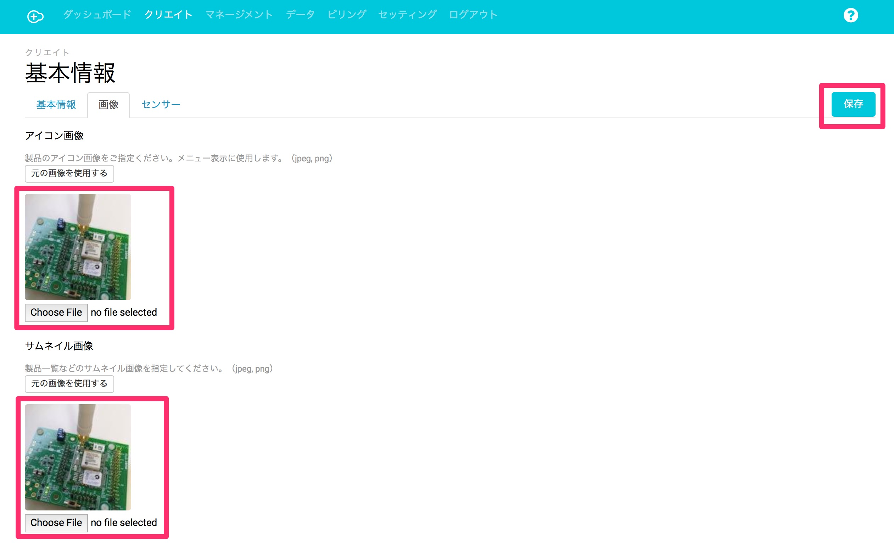

すると画像をアップロードできますので、2ファイルアップロードしてください。もしすぐに用意できない場合は、後回しでも構いません。これらの画像は、iPhoneに表示されますので画像を用意することをお勧めします。また、こちらのタブでも最後に必ず「保存」を押して反映させてください。

基本情報の最後は「センサー」タブへの設定です。センサータブを選択すると次のような画面が現れます。

この画面はすでに5つの温度センサー情報と1つのLED情報を入れてしまっているので6個の情報が入ってしまっていますが、最初は1つもないのでこのように6つの情報を入れていってください。

センサーの登録方法ですが、上記画面の「＋」マークを押してセンサーを追加します。

「＋」マークを押すと次のようなダイアログが出現します。
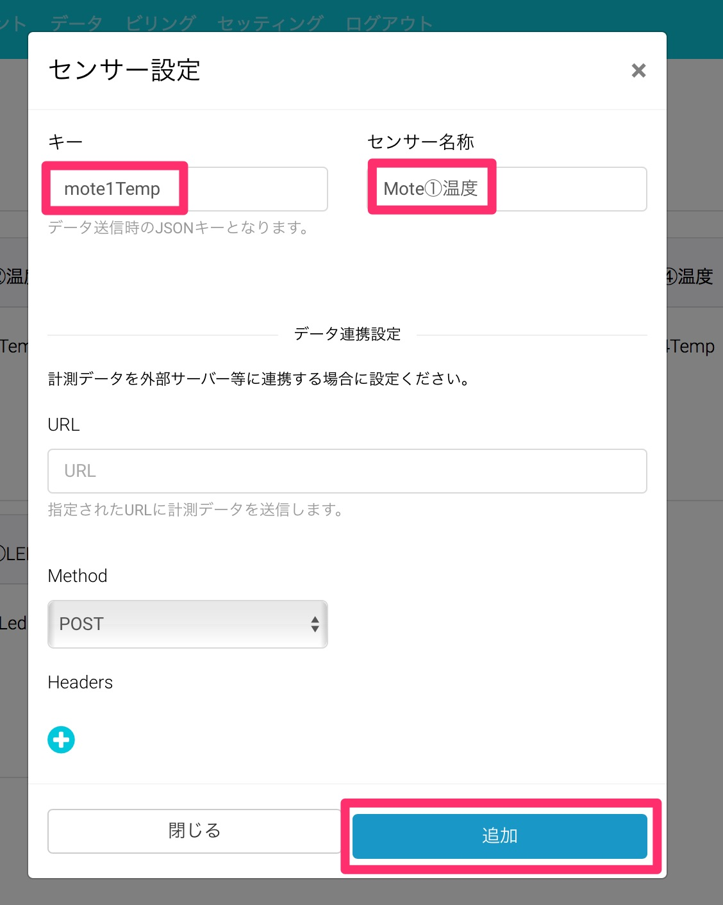

ここで、キーにはセンサーデータを表すJSONのプロパティ名を指定します。今回5つのセンサーデータまで用意できるので、それぞれ次のようにキーを設定します。

1. mote1Temp (名称：Mote①温度)
1. mote2Temp (名称：Mote②温度)
1. mote3Temp (名称：Mote③温度)
1. mote4Temp (名称：Mote④温度)
1. mote5Temp (名称：Mote⑤温度)

このようにキーを複数設定することで、複数のセンサー情報をconect+に渡すことが可能になります。

キーとセンサー名称を入れたら必ず「追加」ボタンを押して追加してください。このようにして5個のセンサー情報を入れます。

次に、LEDの情報も定義を追加します。センサーと同じように「＋」マークを押して同じセンサー設定のダイアログを出します。

温度と異なり、以下のような内容を設定します。

1. mote1Led （名称：Mote①LED）

さらに、URLを指定します。このURLは、CANDY EGGのフローで定義したエンドポイントのURLを指定します。このプロジェクトにあるフローではすでにパス`/mote`が定義されているので、以下のように、アカウントIDを変更したURLを指定します。

    https://bouncyeggs.candy-line.io/アカウントID/api/mote

（ただし、CANDY EGGのサーバーアドレスは上記と異なる場合がありますので、その場合は適宜変更してください）

続いて、Methodが`POST`になっていることを確認します。これは、conect+のウィジェットから送信されるデータのHTTP送信方法がPOSTとなるように指定しています。

最後にHTTPのヘッダーを追加します。CANDY EGGのエンドポイントは基本的にBASIC認証が必須です。このため、`Authorization`ヘッダーを追加します。

値の欄には、`Basic <Base64文字列>`を指定します。Base64文字列は、CANDY EGGのログインユーザーIDとパスワードとコロン（:）を使って、次のようなコマンドで作成できます。

    $ echo -n userid:password | base64
    => dXNlcmlkOnBhc3N3b3Jk

この例では、`Basic dXNlcmlkOnBhc3N3b3Jk`となります。

最後に、右上の「保存」を押して変更を反映します。これを忘れると全て消えてしまいますので忘れないように反映をしてください。
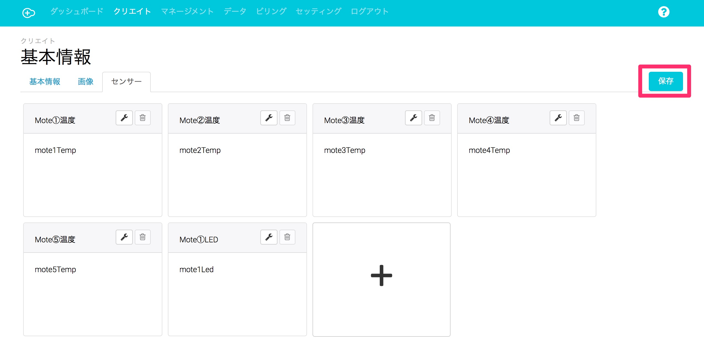

基本情報の次はいよいよiPhoneアプリのUIをデザインします。クリエイトの画面から「アプリウィジェット」を選択します。
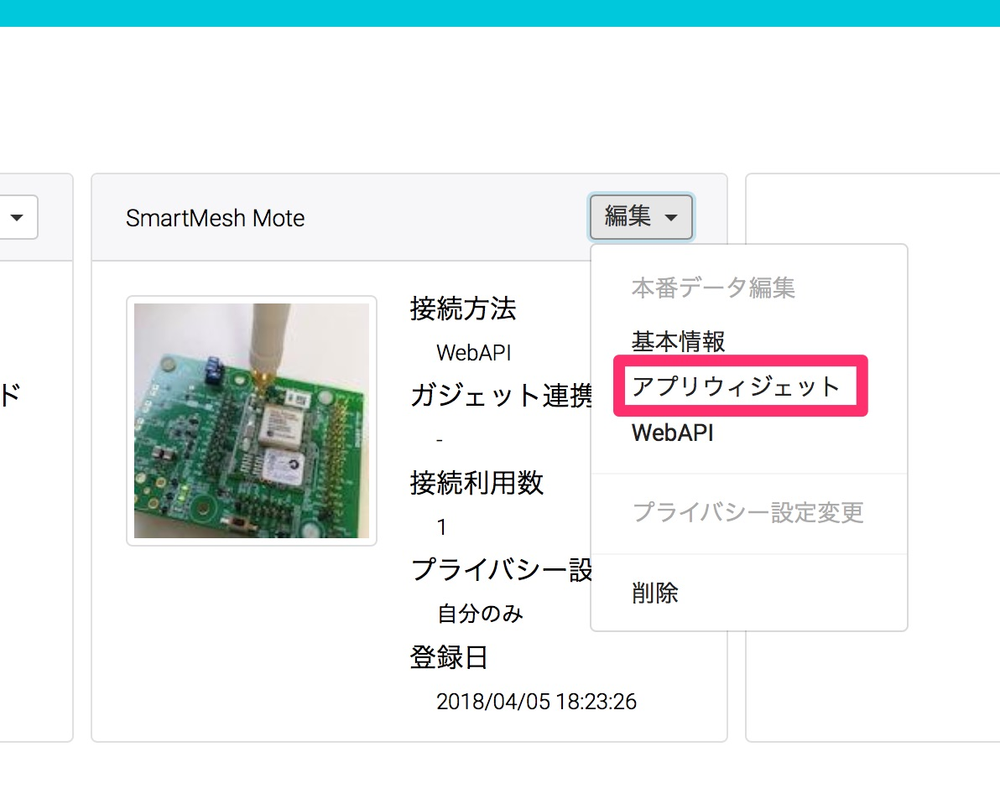

するとこのようにUIデザイン画面が現れます。まずは、LEDの設定スイッチから画面に追加しましょう。
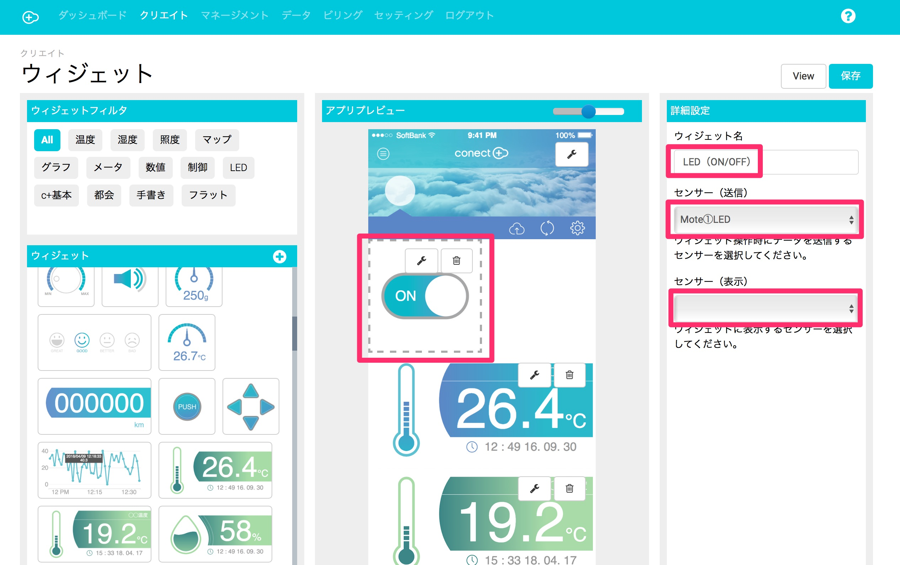
左側の「ウィジェット」ウィンドウからON/OFFスイッチのウィジェットを選んで真ん中の「アプリプレビュー」へドラッグ&ドロップしましょう。

このスイッチのレンチ工具マークをクリックすると、右側の「詳細設定」ウィンドウに設定を入れる箇所が現れます。

この詳細ウィンドウでは、次の内容を入力します。

1. ウィジェット名 ... `LED(ON/OFF)`と入れます
1. センサー（送信） ... `Mote①LED`を選択します
1. センサー（受信） ... 空欄のままにしておきます

続いて、温度表示のウィジェットを追加してみましょう。
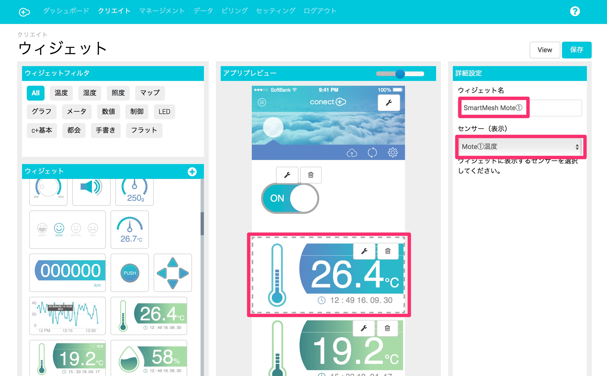

温度のウィジェットもレンチ工具マークをクリックすると、右側の「詳細設定」ウィンドウに設定を入れる箇所が現れます。

ここでは、次のような内容を入れます。

1. ウィジェット名 ... `SmartMesh Mote①`と入れます
1. センサー（受信） ... `Mote①温度`を選択します

これで、1つ目のMoteの温度センサーの値を温度表示ウィジェットに関連づけることができました。

同様にあと4つを追加して、それぞれウィジェット名とセンサー（受信）を関連づけていきます。すると、5つの温度情報をそれぞれウィジェットに関連づけられるようになります。

最後に、右上の「保存」を押します。こちらも押し忘れると反映がされませんのでご注意ください。
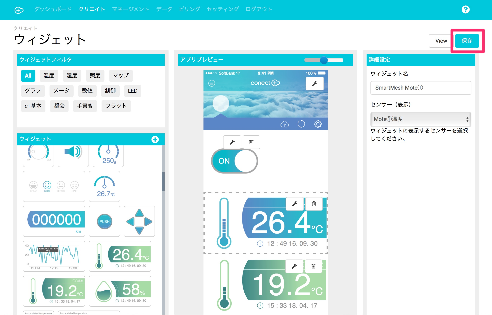

保存したら、クリエイト画面に戻り、最後の設定を行います。ここでは「WebAPI」の設定を行います。
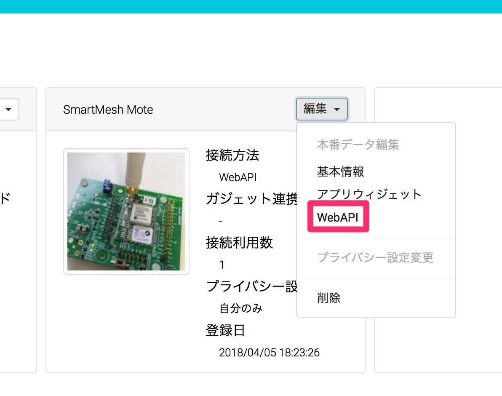

WebAPIの設定では、conect+へデータを保存するために必要なAPIキーの情報やAPIの定義について設定します。

WebAPI設定では、データの読み取りや保存を定義することができます。今回は、データを保存するAPIを使用するので、真ん中のタブから「計測データ保存API」を選択します。
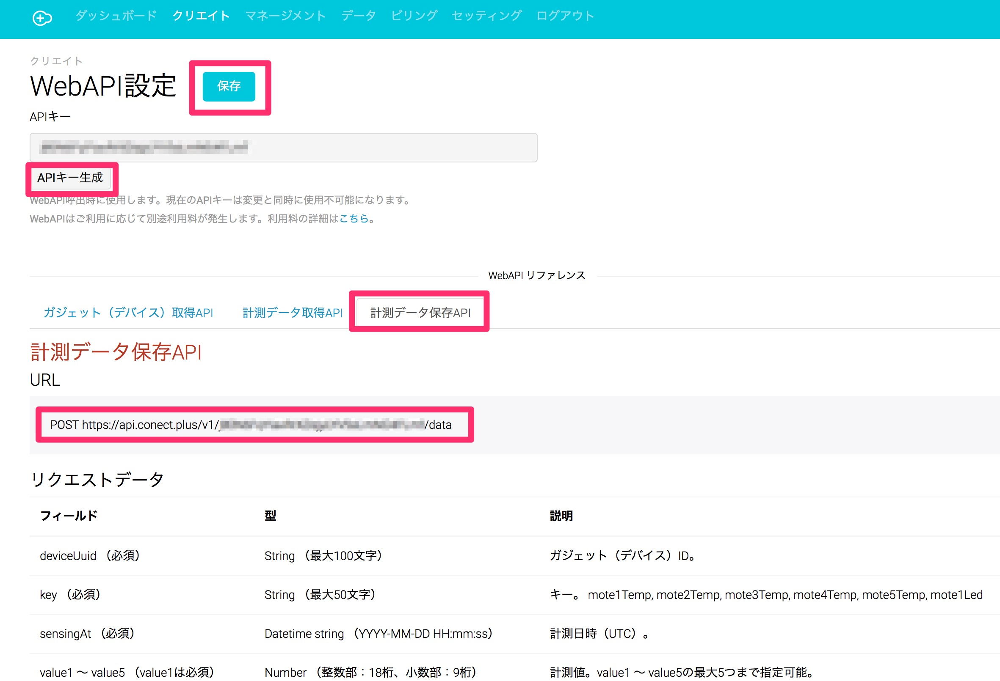

ページの上の方では、APIキーが表示されます。もし表示されていないときは、「APIキー生成」ボタンを押すと新しいキーを生成することができます。このとき、すでにキーがある場合は古いキーは無効になるので注意してください。

「計測データ保存API」を見ると、URLが表示されています。このURLをコピーしてください。CANDY EGGの画面でこの値を使用します。

ここでCANDY EGGの画面に移ります。「CANDY EGG to conect+フロー」を見ると右下に「conect+ Cloud」と書かれているノードがあります。これをダブルクリックします。
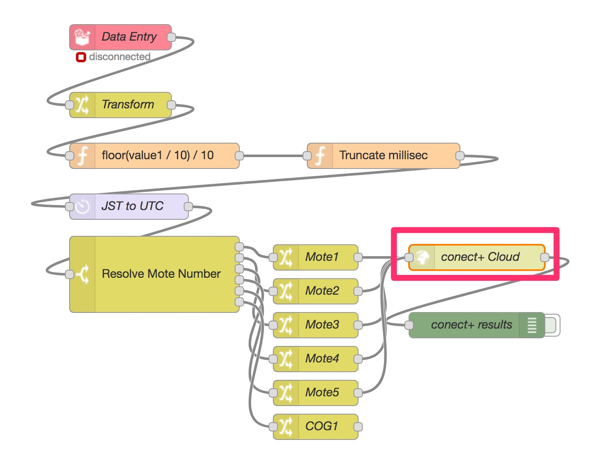

すると、このように詳細を設定できるダイアログが現れます。
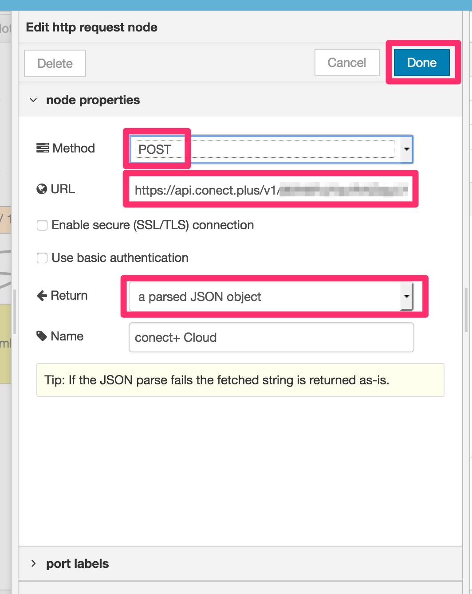

ここで、Methodには「POST」を、URLには先ほどのURLを指定します。このURLはHTTPSですが、その下のチェックボックスはチェックする必要はありません。

また、Returnのところは「a parsed JSON object」を選択しておいてください。

最後に「Done」を押して変更を反映します。

これで、CANDY EGGからconect+へデータを送信することができるようになりました。

続いて、iPhoneアプリの準備をしておきましょう。iPhoneアプリに[conect+のアプリ](https://itunes.apple.com/jp/app/conect/id1240052628?l=ja&ls=1&mt=8)をインストールしてログインします。ログイン後に、雲のアイコンをタップすると、最新のデザインが反映されます。デザインを変更した場合も、このアイコンをタップしてください。
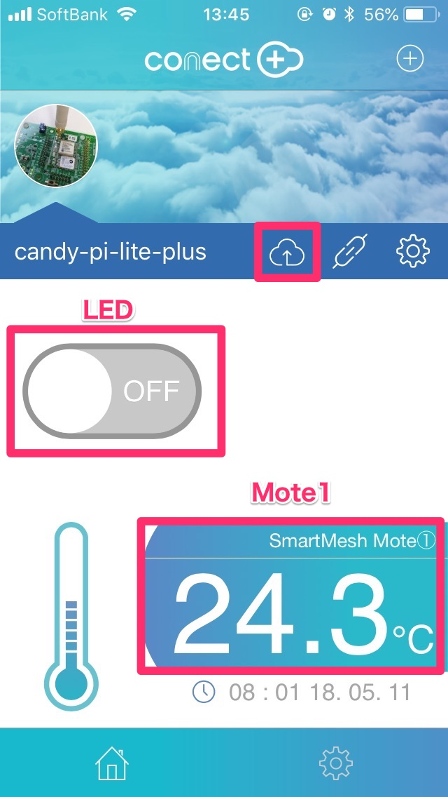

## conect+ to CANDY EGGフロー

- フローファイル：[`candy-egg-002.json`](./candy-egg-002.json)

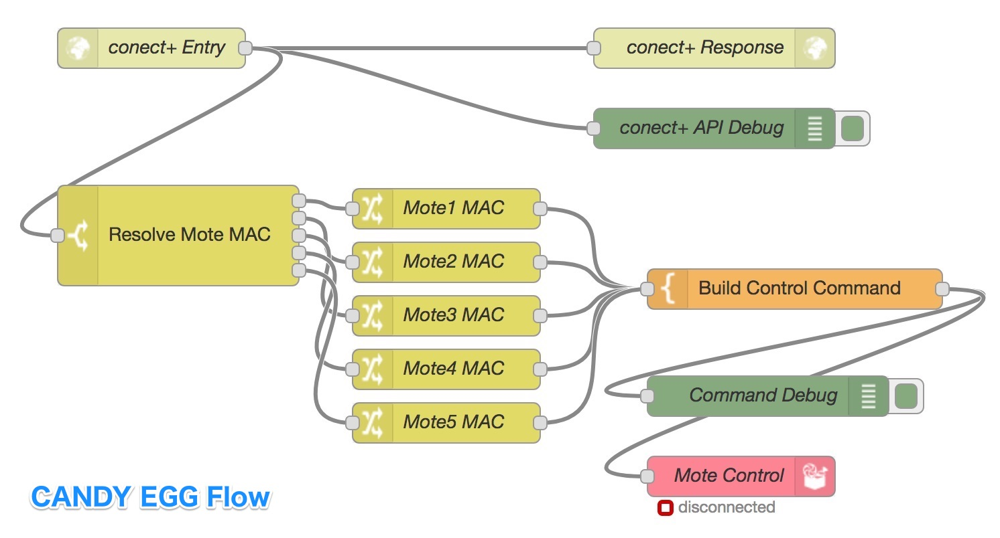

このフローでは、conect+からHTTPのAPI`/mote`に対して送信されたLEDのONまたはOFFの指示を解析して、`CANDY RED`へ要求を転送します。その時に、プロパティ名（キー）を確認して、対応するMACアドレスを割り当てています。

#### このフローのポイント

このフローでは、conect+のLEDセンサー情報とモートのMACアドレスとを関連づけています。この処理そのものは、デバイス側、つまり`CANDY RED`でも実施することは可能です。しかし、このようにクラウド側でアドレスの関連付けを行うことによって、デバイス側のフローを変更せずに済むため、モートの交換や削除といった対応がより簡単に行うことが可能になります。

#### 使用上の注意

インポートしただけではこのフローは機能しません。`Resolve Mote MAC`から繋がっている5つの`Mote MAC`ノードの設定を変更して、Mote1に当たるMACアドレスを正しい値に変更してデプロイし直してください。

## SmartMesh Notificationsフロー

- フローファイル：[`candy-egg-003.json`](./candy-egg-003.json)

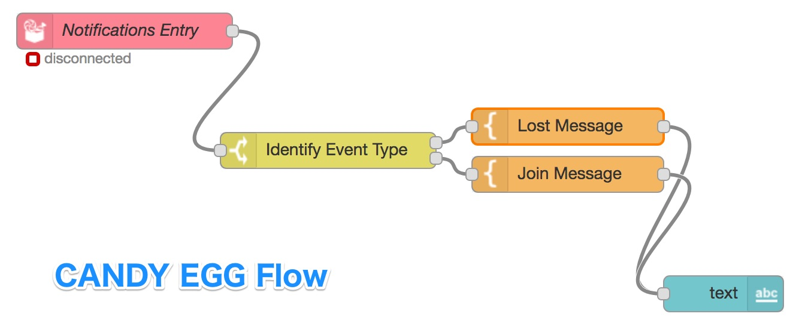

このフローでは、`CANDY RED`からWebsocketのAPI`/notifications`を経由して入ってきたメッシュネットワークの状態イベントからモートの離脱と加入を検出した時にダッシュボードにその内容を表示します。

## CANDY RED デバイス側

### 必要な機器

- Raspberry PiまたはASUS Tinker Board
- [CANDY Pi Lite](https://www.candy-line.io/製品一覧/candy-pi-lite/)または[CANDY Pi Lite+](https://www.candy-line.io/製品一覧/candy-pi-lite-plus/)とnano SIMカード\*
- [DC9021B SmartMesh IP Starter Kit](http://www.analog.com/jp/design-center/evaluation-hardware-and-software/evaluation-boards-kits/dc9021b.html#eb-overview)

\* W-Fiなどでもインターネットにつながれば利用できる場合がありますが、ProxyやFWの設定などによりクラウド側と通信できない場合がありますので基本的にはモバイルネットワークを利用してください。

### 必要なノード

- [`node-red-contrib-smartmesh`](https://flows.nodered.org/node/node-red-contrib-smartmesh) ... SmartMesh®用のノードです。`CANDY RED` v6.1.0以降ではすでにインストールされています。

### SmartMesh Exampleフロー

- フローファイル：[`candy-red.json`](./candy-red.json)

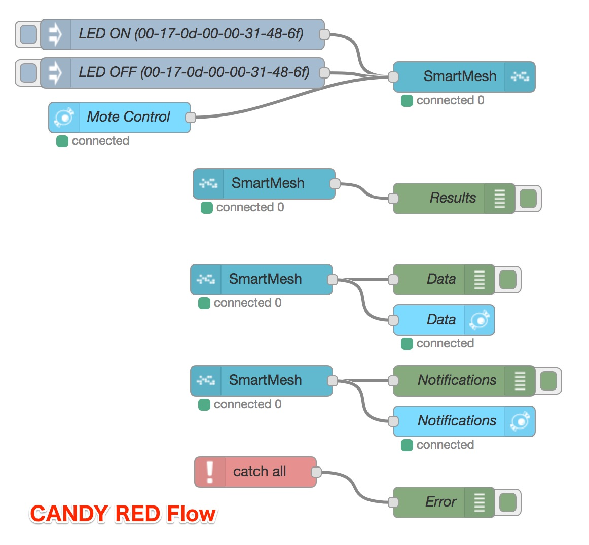

このフローでは、`CANDY EGG`のWebsocket API`/data`と`/control`へ接続し、データやメッシュネットワークの状態イベントを送信したり、`CANDY EGG`からの指示を受信したりします。

#### このフローのポイント

このフローでは、モートのMACアドレスを管理していません。このため、特に変更なくフローをインポートするだけであとはデプロイすればすぐに利用開始することができます。モートのMACアドレスを管理する場合は、`CANDY EGG`のフローを確認してください。

また、本フローは、ラズパイ、ASUS Tinker Boardどちらも利用可能です。

#### 使用上の注意

SmartMesh IPのUSB ManagerをRaspberry PiかASUS Tinker Boardに差し込んだ状態で電源を入れるようにしてください。そうしないと、モートの接続を確認できません。
